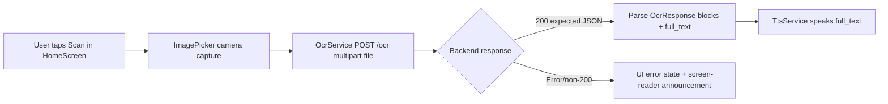
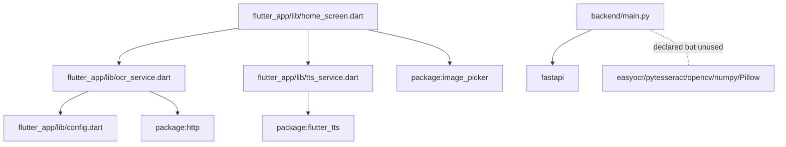

# Architecture Reconstruction

## Observed architecture (current repository)
- **Frontend:** Flutter mobile client (`flutter_app/lib/*`)
- **Backend:** FastAPI service (`backend/main.py`)
- **Current coupling:** Flutter posts captured image to backend `/ocr` endpoint (`flutter_app/lib/ocr_service.dart`), but backend currently exposes only `/health`
- **Architecture maturity:** partially connected prototype; API contract is ahead of backend implementation

## Frontend/backend split
- **Frontend responsibilities (implemented):**
  - Camera capture (`ImagePicker`)
  - Trigger OCR request (`MultipartRequest`)
  - TTS playback (`FlutterTts`)
  - Basic accessibility semantics/announcements
- **Backend responsibilities (implemented):**
  - Health check endpoint only
- **Backend responsibilities (inferred from client + README claims):**
  - OCR execution, block extraction, confidence reporting

## Data flow (implemented vs expected)

**Observed break:** node `D` is currently unresolved in practice because `/ocr` is not implemented in `backend/main.py`.

## Runtime assumptions
- Phone and backend machine on same LAN (`README.md`)
- Backend URL manually configured by IP in app settings (`home_screen.dart::_showSettings`, `config.dart`)
- Plain HTTP transport (`config.dart` endpoint getters)

## Storage behavior
- **Client:** captured image file path is used for upload (`File(photo.path)`); explicit deletion not found.
- **Backend:** no document-processing/storage code currently present.
- **Uncertain:** OS-level media/file retention behavior after capture (would require platform-specific testing).

## Dependency graph (high-level)

## External services
- No external cloud OCR API hardcoded.
- Network call target is user-configured backend host/port.
- No authentication layer found for backend communication.

## Uncertain/needs verification
- Whether hidden/unstaged branch contains OCR backend not present in current checkout.
- Whether Android release build gets camera/internet permissions exclusively via plugin manifest merges.
