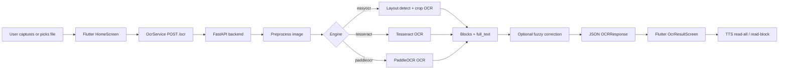
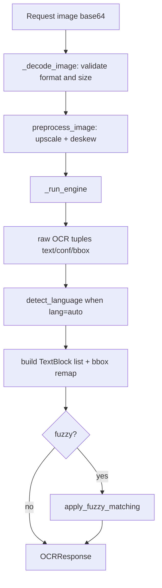

# Architecture Reconstruction (Observed)

## Observed architecture

A **client-server local OCR system**:
- Flutter client captures/selects document images and sends them to backend over HTTP.
- Python FastAPI backend preprocesses image, runs selected OCR engine, structures output into text blocks, and returns text + bounding boxes.
- Optional evaluation path computes WER/CER against provided ground truth text.

**Primary evidence:** `flutter_app/lib/home_screen.dart`, `flutter_app/lib/ocr_service.dart`, `backend/main.py`, `backend/ocr_engine.py`, `backend/preprocess.py`, `backend/layout.py`.

## Frontend/backend split

- **Frontend:** Flutter (`flutter_app/lib/*`)
  - Input: camera/file picker
  - Controls: OCR engine/language/fuzzy options
  - Output UI: image with overlayed blocks + text block list + TTS
- **Backend:** FastAPI (`backend/main.py`)
  - Endpoints: `/health`, `/ocr`, `/ocr/batch`, `/evaluate`, `/evaluate/batch`
  - Engine abstraction: EasyOCR/Tesseract/PaddleOCR

## Data flow

## Processing pipeline (backend view)

## Storage behavior

- Request image bytes are processed in memory for OCR flow.
- **But** debug images are written to disk in `backend/debug/` via `_dbg` and `dbg_boxes` (`backend/preprocess.py`).
- SymSpell dictionaries are downloaded and cached under `backend/symspell_dicts/` (`backend/fuzzy.py`).

## Dependency graph (high level)

- `backend/main.py` depends on: `schemas.py`, `preprocess.py`, `layout.py`, `ocr_engine.py`, `fuzzy.py`, `jiwer`, `lingua`
- `ocr_engine.py` lazily imports OCR libraries per engine.
- Flutter UI depends on `ocr_service.dart` and `tts_service.dart`.

## External services and runtime assumptions

- No backend database detected.
- Optional external dependencies:
  - GitHub raw content for SymSpell frequency dictionaries (`backend/fuzzy.py`)
  - Kaggle API for benchmark dataset download (`benchmark.py`)
- Runtime assumptions:
  - Backend reachable on local network IP/port configured in app (`flutter_app/lib/config.dart` + settings dialog in `home_screen.dart`)
  - Tesseract executable availability is system-dependent (`backend/ocr_engine.py::_configure_tesseract`)

## Uncertain/needs verification

- Full cross-platform camera/file permission behavior in Android without explicit manifest permissions in committed `AndroidManifest.xml` (plugin merge may supply behavior).
- Production deployment model beyond local LAN prototype not found.
