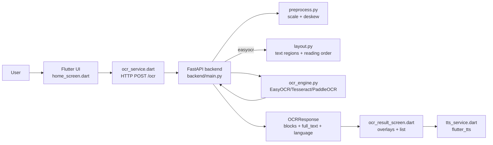
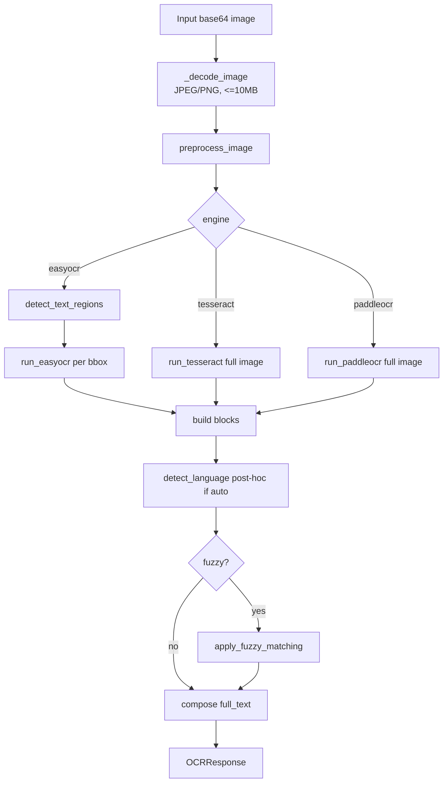

# Architecture Reconstruction

## Observed architecture
A **2-tier local system** is implemented:
1. **Flutter client** captures/selects images and sends base64 payloads to backend (`flutter_app/lib/ocr_service.dart`)
2. **FastAPI backend** preprocesses image, runs selected OCR engine, returns text blocks and full text (`backend/main.py`)

## Frontend/backend split
- **Frontend:** `flutter_app/lib/*`
- **Backend:** `backend/*`
- **Evaluation utilities:** repository root (`benchmark.py`, `benchmark_eval.py`, `prepare_dataset.py`)

## Reconstructed runtime flow

## Backend processing pipeline (from code)

## Storage behavior
- **Persistent logs:** `backend/logs/backend.log` via rotating handler (`backend/main.py`)
- **No database layer found** (not found)
- **Optional dictionary cache:** `backend/symspell_dicts/` created dynamically (`backend/fuzzy.py`)
- **Test/eval artifacts:** `evaluation_results.csv`, `test_photos/*`

## External services/dependencies
- OCR libraries/models: EasyOCR, PaddleOCR, Tesseract local runtime
- Dataset sources: Kaggle API (`benchmark.py`), Hugging Face datasets (`prepare_dataset.py`)
- Dictionary download: GitHub raw FrequencyWords (`backend/fuzzy.py`)

## Runtime assumptions
- Backend reachable on local network by mobile device (`flutter_app/lib/config.dart`, `README.md`)
- Tesseract executable/language packs installed on host for tesseract path (`backend/ocr_engine.py`, `docs/languages.md`)
- GPU availability implicitly assumed for EasyOCR (`gpu=True` in `get_easyocr_reader`)

## Uncertain parts
- PDF handling appears selectable in UI but unsupported by backend image decoder; true intended PDF flow is uncertain.
- README references `eval/` folder but current repository uses root-level scripts; possible stale documentation.
